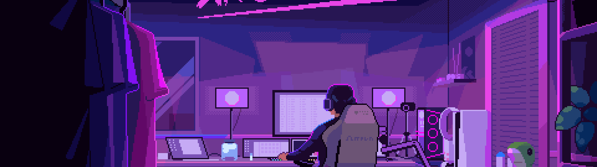

<div align="center">




## Hi 👋, I'm Shyamji

<a href="https://github.com/ShyamRV">
  
</a>


<sub><b><a href="#live">Live</a> · <a href="#flagship">Flagship</a> · <a href="#lab">Recent Builds</a> · <a href="#research">Research</a> · <a href="#stats">Stats</a> · <a href="#connect">Connect</a></b></sub>

</div>

---

<div align="center">

```diff
+@ @ @ @ @ @ @ @ @ @ @ @ @ @ @ @ @ @ @ @ @ @ @ @ @ @ @ @+
@@       o o                                           @@
@@       | |                                           @@
@@      _L_L_                                          @@
@@   ❮\/__-__\/❯  Agents don't replace engineers      @@
@@   ❮(🤖‿🤖)❯   They replace busywork — I build both  @@
@@   ❮/ \`-'/ \❯                                       @@
@@     _/`U'\_     .----------------------------.     @@
@@    ( .   . )    | while(deployed < production)|     @@
@@   / /     \ \   |   agent.deploy();           |     @@
@@   \ |  ,  | /   '----------------------------'     @@
@@    \|=====|/                                        @@
@@     |_.^._|   Ship agents that take real work        @@
@@     | |"| |   off humans' plates — 24/7.           @@
@@     ( ) ( )                                         @@
@@     |_| |_|                                         @@
@@ _.-' _j L_ '-._                                     @@
@@(___.'     '.___)                                    @@
+@ @ @ @ @ @ @ @ @ @ @ @ @ @ @ @ @ @ @ @ @ @ @ @ @ @ @ @+
```

**🤔 AGENT FACT OF THE DAY**


[](https://github.com/ShyamRV/ShyamRV)

</div>


<a id="live"></a>
## ⚡ Live Profile Feed

<div align="center">


<sub>Refreshes every 6 hours via GitHub Actions · inspired by <a href="https://github.com/trinib/trinib">trinib/trinib</a></sub>

</div>


### `// boot_sequence`

```bash
$ whoami
> shyamji_pandey — agentic_ai_engineer @ fetch.ai

$ uptime
> b.tech ai/ml · amity university bengaluru · graduating early (aug 2026)

$ ps -ef | grep ACTIVE
> [RUNNING]  bankvoice-ai          funded by fetch.ai · voice AI for banking & telecom
> [RUNNING]  asi:one-community     community lead · 500+ developers onboarded
> [RUNNING]  uav-cv-research       govt-funded · targeting cvpr / iccv 2026-27
> [RUNNING]  gnn-research          biomedical knowledge graphs · targeting aaai 2027

$ echo $STATUS
> open to full-time agentic ai / ai engineer roles
```

### `// stack`

```yaml
agentic_ai:
  - Fetch.ai uAgents · Agentverse · ASI:One · Almanac
  - LangChain · LangGraph · CrewAI · MCP · A2A · RAG

cv_and_graph_ml:
  - PyTorch · TensorFlow · YOLO (v5-v10) · ResNet · OpenCV
  - GCN · GAT · GraphSAGE · Node2Vec · PyG · DGL

engineering:
  - Python · TypeScript · FastAPI · Next.js · Node.js
  - PostgreSQL · Docker · Kubernetes

cloud_and_infra:
  - AWS Bedrock / SageMaker · GCP Vertex AI · Elasticsearch

commerce_and_auth:
  - Stripe · UCP · OAuth2 · Twilio
```


<a id="flagship"></a>
## 🏦 Flagship Project

<div align="center">


**[banking-voice-ai](https://github.com/ShyamRV/banking-voice-ai)** — replacing human call executives with autonomous AI agents

</div>

Funded by Fetch.ai. An enterprise-grade multi-agent voice platform for banks, healthcare, insurance, and telecom — handling calls and chats autonomously, 24/7, across 10+ Indian languages.

<div align="center">

| Real-World Impact | |
|---|---|
| **Funded by** | Fetch.ai |
| **Modeled savings** | ~$230K/month vs a 500-executive call centre |
| **Addressable market** | ₹64,000 Cr+ |
| **Industries** | Banks · NBFCs · Healthcare · Insurance · Telecom · Real Estate · Ed-Tech |
| **Compliance** | RBI PSS Act 2007 · TRAI DLT Act 2023 · India-only data residency |

</div>

`Fetch.ai uAgents` · `ASI:One` · `OpenAI Whisper` · `Amazon Polly` · `Twilio` · `FastAPI` · `Python`


<a id="lab"></a>
## 🧪 Recent Builds — Fetch.ai Innovation Lab

Production uAgents shipped this year — app generation, event networking, and agentic commerce.

### 🧩 Next.js Sandbox Agent
**[nextjs-sandbox-agent](https://github.com/ShyamRV/nextjs-sandbox-agent)**

A uAgents chat agent that turns a natural-language prompt into a live, deployed Next.js application — no manual setup required.

- First generation is free; follow-up edits are paid
- Live preview before anything ships
- Publishes straight to GitHub and Vercel

`Python` · `uAgents` · `ASI:One` · `Next.js` · `Vercel` · `Stripe` · `Docker`

---

### 🤝 Meetup Agent
**[meetup-agent](https://github.com/ShyamRV/meetup-agent)**

An event-scoped networking agent on Agentverse — attendees join via QR code and get matched with the most relevant people in the room.

- Top-5 ranked connections in ~60 seconds
- LLM-generated explanations + a shareable AI profile card
- Event data auto-expires after 30 days

`Python` · `uAgents` · `ASI:One` · `PostgreSQL` · `OAuth2` · `Docker`

---

### 🛍️ Universal Marketplace Agent
**[universal-marketplace-agent](https://github.com/ShyamRV/universal-marketplace-agent)**

A conversational shopping agent that turns a multi-item request — gaming setup, outfit, electronics — into a ready-to-pay cart across live merchants.

- Discovers and prices items across multiple merchants in one go
- Optimizes for landed cost, not just sticker price
- Falls back to a merchant redirect when checkout can't complete natively

`Python` · `uAgents` · `ASI:One` · `UCP` · `Stripe` · `PostgreSQL` · `Docker`


<a id="research"></a>
<details>
<summary><b>🔬 Research & Talks</b> — click to expand</summary>
<br>

```yaml
computer_vision:
  title: YOLO + ResNet for Real-Time UAV Object Detection
  status: Manuscript in preparation — targeting CVPR / ICCV 2026-27
  result: 30+ FPS on embedded hardware, 40% smaller model, no accuracy loss

graph_neural_networks:
  title: GCN / GAT Link Prediction on Biomedical Knowledge Graphs
  status: Manuscript in preparation — targeting AAAI 2027 / Bioinformatics journal
  result: Benchmarked against DeepWalk, Node2Vec, LINE on a 10K+ node graph

talks:
  - "A Deep Dive into Building a Multi-Agent System on the Fetch.ai Ecosystem"
    venue: New Relic HQ, Bengaluru · Mar 2026 · 100+ engineers
  - "How Agentic AI is Turning LLMs into Autonomous Products"
    venue: Hacknight Bengaluru — Elastic + AWS · May 2026 · 200+ engineers
```

</details>

<details>
<summary><b>🗂️ Past Builds</b> — click to expand</summary>
<br>

| Project | What it is | Result |
|---|---|---|
| **ResQ Bengaluru** | AI-powered pet-rescue triage and NGO/vet matching | 🥇 1st Place — Hacknight Bengaluru 2026 |
| **NEO PRIME** | SLM-controlled robotic arm with vision-guided re-planning | 95% pick-and-place success, 500+ cycles |
| **NexusC** | Multi-agent pipeline automating end-to-end YouTube uploads | Saves creators 30+ hrs/week |

</details>


<a id="stats"></a>
<div align="center">

## 🐍 Contribution Snake


<sub>Eats through real commit history · updates every 6 hours via GitHub Actions</sub>


## 🏆 Trophy Case


## 📊 GitHub Analytics


### `// toolbelt`


</div>


<a id="connect"></a>
<div align="center">

## 📡 Connect

[](https://github.com/ShyamRV/ShyamRV)
[](https://linkedin.com/in/shyamji-pandey)
[](https://github.com/ShyamRV)
[](https://www.youtube.com/@NeuroManShyam)
[](mailto:shyamjipandeyrv@gmail.com)


<br/><br/>
<i>Building the agentic future, one autonomous agent at a time.</i>

</div>


